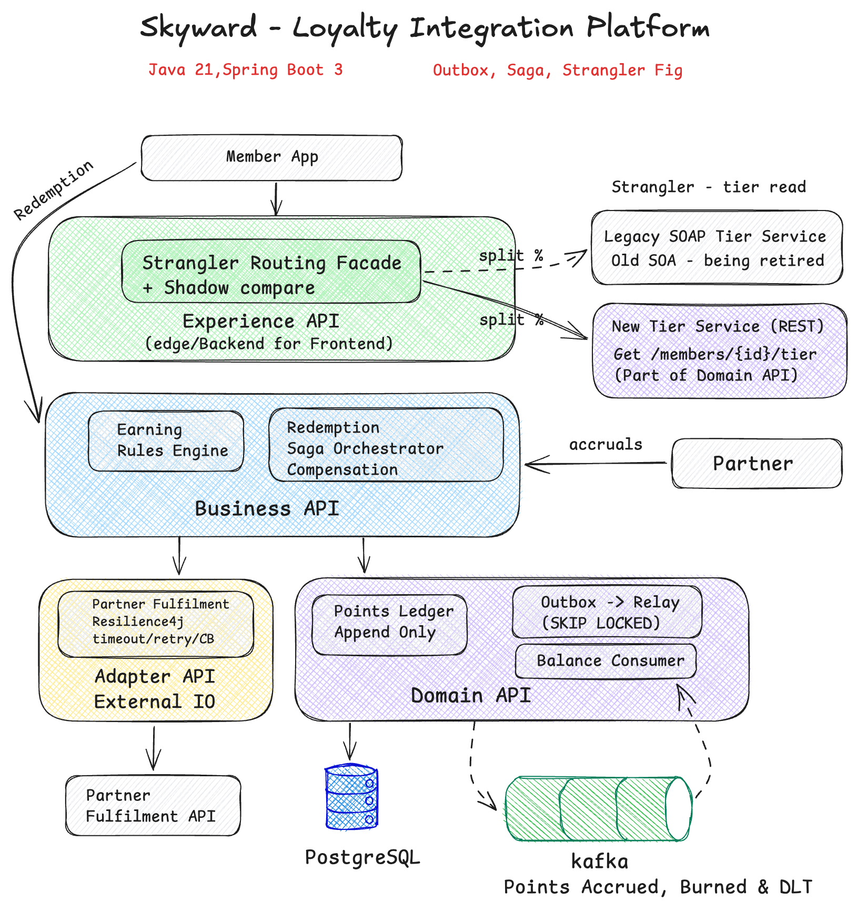

# Skyward — Loyalty Integration Platform

> An event-driven loyalty-points platform that demonstrates three production-grade integration patterns —
> the **Transactional Outbox**, an **orchestrated Saga** with compensation, and the **Strangler Fig** — in a
> clean, layered **Java 21 / Spring Boot 3** codebase, tested end-to-end against **real Kafka and Postgres**.




---

## Overview

Modern airline loyalty runs on **integration**: real-time APIs, asynchronous event streams, partner
systems, and decades-old services that have to be modernised *without* downtime. This project is a focused,
runnable showcase of exactly that — built to demonstrate **depth in Java/Spring** and **integration
architecture judgment**, rather than breadth of features.

Instead of a wide-but-shallow app, it goes deep on the three patterns that actually carry an integration
platform, and gets the *hard parts* right: crash-safety, idempotency, compensation, and a reversible legacy
cutover. Every slice is **test-first** (Testcontainers, real infrastructure) and every non-trivial decision
is captured in an ADR.

## Integration Patterns

| Pattern | Flow | The problem it solves |
|---|---|---|
| **Transactional Outbox** | Accrual | The *dual-write* problem — the DB and Kafka can never drift, even on a crash. |
| **Orchestrated Saga + compensation** | Redemption | A multi-step transaction across a flaky partner, with no distributed transaction. |
| **Strangler Fig** | Tier reads | Migrate a legacy SOAP service to a new microservice — incrementally and reversibly. |

## Demo


*A live run (`make demo`) — no edits, no mocks. It shows two of the three patterns — here's what you're
seeing, and why it matters.*

- **① Strangler Fig** — the same `GET /members/{id}/tier` is served for six members, and the `source`
  column shows the split: some answered by the **legacy SOAP** service (`BRONZE`), some by the **new REST**
  service (`GOLD`). Routing is **config-driven** and **sticky per member**, so you cut over a percentage of
  traffic at a time, roll back by lowering it, and every member gets a consistent answer. *Zero-downtime
  migration.*
- **② Accrual (Outbox)** — points are earned (1,000 base × 1.25 tier × 2.0 campaign = 2,500), but the balance updates
  **asynchronously**: ledger entry + event are written in **one DB transaction**, a relay publishes to
  **Kafka**, and a consumer updates the balance projection. Replaying the same accrual returns `DUPLICATE`
  — at-least-once delivery, **never double-credited.**

> The third pattern — the **redemption saga with compensation** — is walked through in
> [`docs/walkthrough.md`](docs/walkthrough.md).

## Getting Started

**Prereqs:** Docker (running), JDK 21. `curl` always; `jq` optional.

```bash
make up      # build, start Postgres + Kafka, start all 3 services, wait for health
make demo    # run all three flows end-to-end, narrated
make down    # stop everything   (make purge also wipes the DB volume)
```

Per-flow: `make demo-strangler` · `demo-accrual` · `demo-redeem` · `demo-compensate` · `demo-shadow`.
Run `make` to list every target. Full manual `curl` walkthrough: [`scripts/README.md`](scripts/README.md).

| Service | URL |
|---|---|
| Core (business + domain) | `http://localhost:8080` — Swagger at `/swagger-ui` |
| Legacy SOAP service | `http://localhost:8081` — WSDL at `/ws/tiers.wsdl` |
| Experience / edge (strangler facade) | `http://localhost:8082` |

## Architecture

Four logical layers with dependencies pointing **inward** to the domain, shipped as **three** runnable
deployables (see the diagram above):

- **Experience** — thin edge/BFF; hosts the strangler routing facade. No data, no business rules.
- **Business** — orchestration & rules: the earning-rules engine and the redemption saga.
- **Domain** — owns data: members, tiers, the **append-only ledger**, the **outbox**, and the balance
  **projection** (balance is *derived*, never an overwritten column).
- **Adapter** — all external I/O: partner fulfilment (Resilience4j) and the legacy SOAP service.

Full structural + behavioural walkthrough, with code and the Java/Spring nuances:
**[`docs/walkthrough.md`](docs/walkthrough.md)**.

## Tech Stack

Java 21 (virtual threads on read paths) · Spring Boot 3.3 (Web, Kafka, Data JPA, Validation, Actuator) ·
Apache Kafka (KRaft, no Zookeeper) · PostgreSQL + Flyway · Resilience4j · Spring-WS (SOAP) ·
Gradle (Kotlin DSL, multi-module) · JUnit 5 + Testcontainers · springdoc-openapi · Docker Compose.

## Engineering Decisions

The *why* behind the hard parts, as Architecture Decision Records:

- [ADR-0001 — Outbox over direct publish](docs/adr/0001-outbox-over-direct-publish.md) (including the Debezium CDC alternative)
- [ADR-0002 — Orchestrated saga over choreography](docs/adr/0002-orchestrated-saga.md)
- [ADR-0003 — Strangler routing facade](docs/adr/0003-strangler-routing-facade.md)

A few decisions worth calling out: the outbox relay is **at-least-once** (publish before marking sent →
consumers must be idempotent); the saga distinguishes **definite vs indeterminate** failure so a partner
timeout *after* fulfilment never gives the reward *and* keeps the points; strangler routing is **sticky by
member** so the same person never flaps between systems mid-migration; and consumers retry, then route
poison messages to a **dead-letter topic (DLT)** — no blocked partitions, no silent loss.

## Out of Scope

Booking / inventory / NDC · payments · a full identity provider (requests are currently unauthenticated;
OIDC + mTLS would sit at the edge in production) · a standalone API gateway (the Experience layer *is* the
edge; a gateway sits in front in production) · a web UI (the "UI" is Swagger + the demo above). The focus is
the three integration patterns.

## Roadmap

Structured JSON logging + correlation IDs across the flows · Micrometer metrics + Prometheus (the
strangler **shadow-compare mismatch rate** is the first thing I'd alert on) · a second partner adapter with
a different contract (proving the adapter layer abstracts heterogeneous partners) · a stubbed auth filter ·
Kubernetes manifests per deployable.
